# 🏢 Enterprise Active Directory Home Lab

> Deployment and documentation of a Microsoft Active Directory environment using Windows Server 2022 and VMware Workstation Pro.

---

## 📖 Overview

This project documents the first stage of my personal Active Directory home lab.

The objective was to build a virtualized Windows Server environment from scratch, install Active Directory Domain Services, promote the server to a Domain Controller and create an initial enterprise directory structure.

The environment was organized using Organizational Units, users and groups in order to simulate the centralized identity and resource management found in a professional Windows infrastructure.

This Active Directory environment will later become the foundation for additional Blue Team and SOC projects, including:

- Windows Event Log analysis
- Sysmon deployment
- Wazuh SIEM
- Splunk
- Detection Engineering
- SOC monitoring and incident investigation

---

## 🎯 Objectives

The objectives of this first deployment were to:

- Install VMware Workstation Pro
- Deploy a Windows Server 2022 virtual machine
- Install Windows Server from an official ISO image
- Install Active Directory Domain Services
- Install the DNS Server role
- Create a new Active Directory forest
- Promote the Windows Server as a Domain Controller
- Create an Active Directory domain
- Open and verify Active Directory Users and Computers
- Create Organizational Units
- Create users and security groups
- Organize enterprise resources by geographical region

---

## 🏗️ Lab Architecture

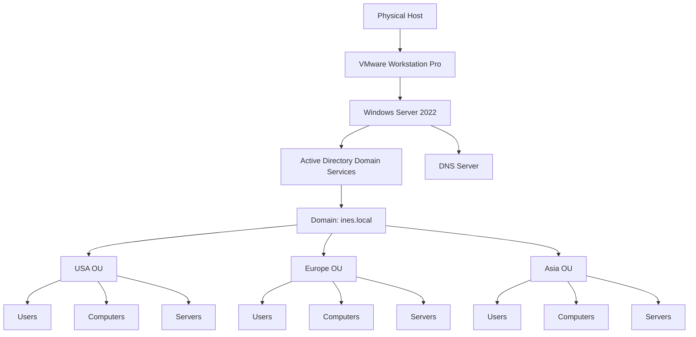

> Replace `ines.local` if the actual domain configured in the lab uses another name.

---

## 💻 Environment

| Component | Technology |
|---|---|
| Hypervisor | VMware Workstation Pro 17 |
| Server operating system | Windows Server 2022 |
| Directory service | Active Directory Domain Services |
| Name resolution | Windows DNS Server |
| Administration console | Active Directory Users and Computers |
| Environment type | Isolated personal home lab |

---

## 🛠️ Technologies Used

- VMware Workstation Pro
- Windows Server 2022
- Active Directory Domain Services
- Windows DNS Server
- Server Manager
- Active Directory Users and Computers
- Organizational Units
- Security Groups
- Identity and Access Management

---

# 1️⃣ VMware Workstation Installation

## Purpose

The laboratory was deployed using **VMware Workstation Pro**.

Virtualization makes it possible to create an isolated enterprise environment without modifying the physical host or affecting a production network.

It also allows the laboratory to be expanded later with additional systems such as:

- Windows client machines;
- Kali Linux;
- Wazuh;
- Splunk;
- Sysmon;
- other SOC monitoring tools.

## Deployment

VMware Workstation Pro was downloaded and installed on the physical Windows host.


---

# 2️⃣ Windows Server 2022 Installation

## ISO acquisition

The official Windows Server 2022 evaluation ISO was downloaded from the Microsoft Evaluation Center.


## Virtual machine creation

A new virtual machine was created in VMware Workstation Pro and configured to use the Windows Server 2022 ISO.

The virtual machine acts as the central server of the laboratory and will provide authentication, DNS and directory services.

## Server deployment

Windows Server 2022 was installed inside the virtual machine.

After the first boot, **Server Manager** opened automatically and was used to configure the server roles.


---

# 3️⃣ Active Directory Domain Services Installation

## Role installation

Active Directory Domain Services was installed from Server Manager using the following path:

```text
Manage
→ Add Roles and Features
→ Role-based or feature-based installation
→ Select destination server
→ Active Directory Domain Services
```


## Required features

Windows Server automatically proposed the additional management tools required for Active Directory.

These included tools such as:

- Group Policy Management;
- Active Directory Administrative Center;
- Active Directory PowerShell module;
- Active Directory Users and Computers;
- Remote Server Administration Tools.


The DNS Server role was also enabled because Active Directory relies heavily on DNS to locate Domain Controllers and other domain services.

---

# 4️⃣ Creating a New Active Directory Forest

Once the AD DS role was installed, the server still needed to be promoted to a Domain Controller.

The post-deployment configuration wizard was opened and the following option was selected:

```text
Add a new forest
```

The root domain configured for the laboratory was:

```text
ines.local
```


## Why create a new forest?

A forest is the highest logical structure in Active Directory.

Because this was a new and independent laboratory, there was no existing domain or forest to join. Creating a new forest established the first Active Directory domain and the first Domain Controller of the environment.

---

# 5️⃣ Domain Controller Configuration

During the Domain Controller configuration, the following components were enabled:

- Domain Name System server;
- Global Catalog;
- Directory Services Restore Mode password.

The forest and domain functional levels were configured using the most recent option available in the deployment wizard.


## DNS

The Domain Controller also hosts the DNS service.

DNS is essential in an Active Directory environment because clients use it to:

- find the Domain Controller;
- locate authentication services;
- resolve internal domain names;
- access domain resources.

## Directory Services Restore Mode

A Directory Services Restore Mode password was configured.

This account can be used for maintenance and recovery operations if Active Directory becomes unavailable.

The password is intentionally not included in this repository.

---

# 6️⃣ Promoting the Server to a Domain Controller

After completing the prerequisite checks, the installation was launched.

The server restarted automatically and became the first Domain Controller of the new forest.

After rebooting, the domain name appeared on the Windows authentication screen, confirming that the server was now connected to the newly created Active Directory domain.

The server now provides:

- centralized identity management;
- domain authentication;
- DNS services;
- Active Directory administration;
- policy management capabilities.

---

# 7️⃣ Verifying Active Directory

After logging back into the server, the **Active Directory Users and Computers** console was opened.

The newly created domain appeared in the console, confirming that Active Directory had been successfully deployed.


At this point, the laboratory contained:

- one Windows Server 2022 virtual machine;
- one Domain Controller;
- one Active Directory forest;
- one Active Directory domain;
- one DNS Server.

---

# 8️⃣ Creating Organizational Units

## Purpose of Organizational Units

Organizational Units allow Active Directory objects to be organized logically.

They can contain:

- users;
- groups;
- computers;
- servers;
- other Organizational Units.

They also simplify:

- Group Policy application;
- delegated administration;
- access management;
- large-scale user and computer administration.

## Structure created

The domain was organized using geographical Organizational Units:

```text
ines.local
├── USA
│   ├── Computers
│   ├── Users
│   └── Servers
├── Europe
│   ├── Computers
│   ├── Users
│   └── Servers
└── Asia
    ├── Computers
    ├── Users
    └── Servers
```


This design simulates an organization operating across several geographical regions.

Each regional OU can later receive different:

- Group Policies;
- security configurations;
- delegated permissions;
- administrative settings.

---

# 9️⃣ Creating Users and Groups

Users and groups were created inside the appropriate Organizational Units.

## Users

User accounts represent employees who will later authenticate to Windows client machines connected to the domain.

Each account can receive:

- a unique username;
- a password;
- group memberships;
- access permissions;
- domain policies.

## Security groups

Security groups make access management easier by assigning permissions to a group instead of configuring every user individually.

For example, a group could later be granted access to:

- a network share;
- a department folder;
- a server;
- an administrative tool;
- a specific application.


---

# 🔐 Security Considerations

Several security principles are relevant to this environment:

## Least privilege

Users should only receive the permissions required for their role.

## Group-based permissions

Permissions should preferably be assigned to security groups rather than directly to individual users.

## Separation of administration

Administrative accounts should be separated from standard daily user accounts.

## Structured Organizational Units

A clear OU design makes it easier to apply security policies consistently.

## DNS protection

Because Active Directory depends on DNS, unauthorized DNS modifications can affect authentication and domain availability.

---

# ✅ Deployment Summary

During this first stage of the Active Directory home lab, I:

- installed VMware Workstation Pro;
- downloaded and installed Windows Server 2022;
- deployed a Windows Server virtual machine;
- installed Active Directory Domain Services;
- installed the DNS Server role;
- created a new Active Directory forest;
- created the `ines.local` domain;
- promoted the server to a Domain Controller;
- verified the installation through Active Directory Users and Computers;
- created a geographical OU structure;
- created users and security groups.

---

# 📚 Skills Developed

- VMware administration
- Windows Server installation
- Windows Server administration
- Active Directory Domain Services
- Domain Controller deployment
- DNS fundamentals
- Identity and Access Management
- Organizational Unit design
- User account management
- Security group management
- Enterprise infrastructure documentation

---

# 🚀 Next Steps

The Active Directory environment will be expanded with:

- a Windows client machine;
- domain join configuration;
- additional users and groups;
- Group Policy Objects;
- shared folders and permissions;
- password and account lockout policies;
- Windows Event Log analysis;
- Sysmon;
- Wazuh SIEM;
- Splunk;
- Detection Engineering;
- simulated attack and investigation scenarios.

---

# 🔟 Group Policy Management

## Overview

After deploying Active Directory Domain Services and creating the initial Organizational Unit structure, I continued building the laboratory by configuring **Group Policy Objects**, also known as GPOs.

Group Policy provides centralized management of Windows computers and user environments within an Active Directory domain.

Instead of manually configuring every workstation, an administrator can define a policy once and apply it automatically to:

- the entire domain;
- one or more Organizational Units;
- specific users;
- specific computers;
- selected security groups.

This makes Group Policy an essential component of enterprise Windows administration and endpoint security.

The **Group Policy Management Console** was installed with the Active Directory management tools and was used to manage the policies for the `ines.local` domain.

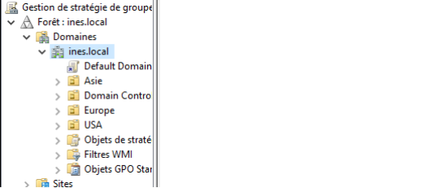

---

## Understanding Group Policy Objects

A Group Policy Object contains configuration settings that can be applied to domain users or domain computers.

The main configuration categories are:

| Configuration type | Scope |
|---|---|
| Computer Configuration | Applies to the computer, regardless of which user signs in |
| User Configuration | Applies to the user account after authentication |

### Computer Configuration

Computer Configuration is used for settings related to the Windows device itself.

Examples include:

- security settings;
- Windows services;
- startup scripts;
- firewall settings;
- software deployment;
- removable storage restrictions;
- local computer policies.

These settings remain associated with the computer and do not change depending on the user who logs in.

### User Configuration

User Configuration is used for settings associated with user accounts.

Examples include:

- desktop customization;
- mapped network drives;
- Control Panel restrictions;
- login scripts;
- Start menu configuration;
- application settings.

These settings follow the user when they sign in to a domain-joined computer covered by the policy.

---

## Policies and Preferences

Both Computer Configuration and User Configuration contain two important categories:

```text
Policies
Preferences
```

### Policies

Policies are administrative rules enforced by the domain.

They are generally used for security requirements and restrictions that users should not be able to modify.

Examples include:

- password requirements;
- account lockout rules;
- access restrictions;
- security options;
- removable storage restrictions.

### Preferences

Preferences are used to configure an initial environment without always preventing the user from changing it afterward.

Examples include:

- desktop shortcuts;
- mapped network drives;
- printers;
- files and folders;
- registry settings.

This distinction helps administrators choose whether a setting should be strictly enforced or simply provided as a default configuration.

---

# 1️⃣1️⃣ Password Policy GPO

## Purpose

The first security configuration involved reviewing and modifying the domain password policy.

A password policy improves account security by defining minimum requirements for passwords used by domain users.

The policy was configured through:

```text
Computer Configuration
└── Policies
    └── Windows Settings
        └── Security Settings
            └── Account Policies
                └── Password Policy
```

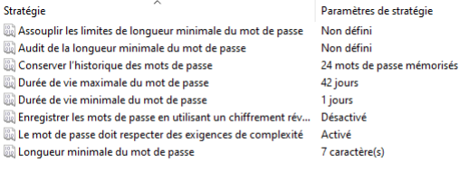

---

## Password Complexity

The **Password must meet complexity requirements** setting was enabled.

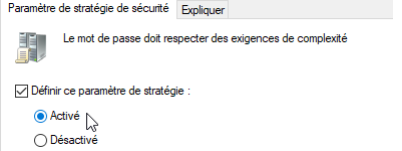

When complexity requirements are enabled, Windows requires passwords to respect several rules.

Depending on the Windows configuration, passwords should not contain the complete account name and should include characters from several categories, such as:

- uppercase letters;
- lowercase letters;
- numbers;
- special characters.

This reduces the likelihood that users choose passwords that are easy to guess.

---

## Maximum Password Age

The maximum password age was also modified.

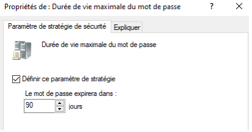

This setting defines how long a user may keep the same password before Windows requests a change.

Password expiration can limit the duration during which a compromised password remains useful. However, it should be combined with:

- sufficient password length;
- password history;
- account lockout protection;
- multifactor authentication where possible;
- monitoring of suspicious authentication attempts.

---

## Security Benefits

The password policy contributes to:

- stronger user authentication;
- reduced use of weak passwords;
- consistent requirements across the domain;
- centralized identity security;
- easier enforcement of organizational standards.

---

# 1️⃣2️⃣ Drive Mapping GPO

## Purpose

A Drive Mapping GPO was created to automatically provide users with access to a network location.

Mapped drives are commonly used in enterprise environments to give employees access to:

- shared departmental folders;
- personal home directories;
- common organizational resources;
- project documentation;
- internal file servers.

Instead of asking every user to manually configure the drive, Group Policy can create it automatically when the user signs in.

---

## Configuration Path

The mapped drive was configured through:

```text
User Configuration
└── Preferences
    └── Windows Settings
        └── Drive Maps
```

A new mapped drive was then created and configured with:

- a network location;
- a drive letter;
- a display name;
- the required action.

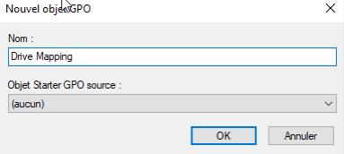

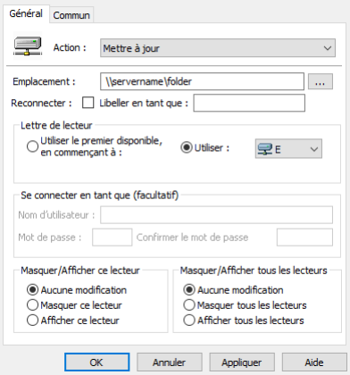

The location followed the standard UNC format:

```text
\\SERVER\Share
```

A drive letter was assigned so that the network resource would appear directly in File Explorer.

---

## Result

Once the policy was applied, the mapped drive appeared automatically for the targeted user.

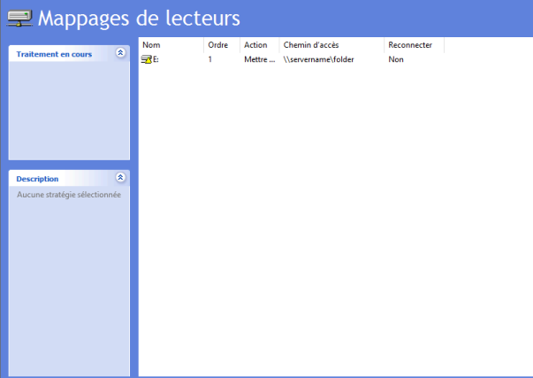

This demonstrates how Group Policy Preferences can automate workstation configuration and provide users with consistent access to business resources.

---

## Administrative Benefits

Drive mapping through Group Policy provides:

- centralized configuration;
- fewer manual support requests;
- consistent access to shared resources;
- easier updates when a server path changes;
- different mappings for different departments or OUs.

---

# 1️⃣3️⃣ Desktop Wallpaper Policy

## Purpose

A Desktop Wallpaper GPO was configured to apply a standardized background to domain users.

Organizations may use a common wallpaper to:

- maintain visual consistency;
- display the company identity;
- communicate internal information;
- identify managed corporate computers;
- display security or compliance reminders.

---

## Configuration Path

The wallpaper policy was configured through:

```text
User Configuration
└── Policies
    └── Administrative Templates
        └── Desktop
            └── Desktop
                └── Desktop Wallpaper
```

The policy was enabled and configured with the location of the wallpaper file.

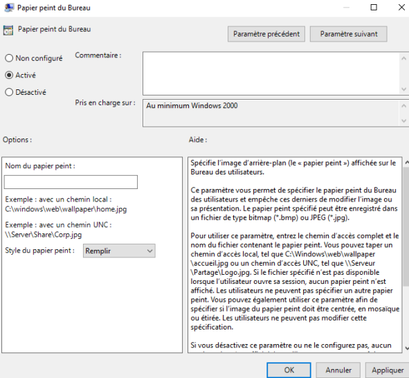

Once applied, targeted users receive the configured wallpaper when they sign in.

---

## Security Considerations

The wallpaper file should be stored in a location accessible to the targeted users.

In an enterprise environment, this could be:

- a shared network folder;
- the SYSVOL directory;
- a managed local path;
- a distributed file server.

Access permissions should prevent unauthorized modification of the file.

---

# 1️⃣4️⃣ Restricting Control Panel Access

## Purpose

A GPO was created to prevent users from accessing the Windows Control Panel and Settings application.

This restriction helps reduce the risk of users modifying important workstation settings.

Without appropriate restrictions, users could potentially change:

- network configurations;
- installed applications;
- system preferences;
- device settings;
- security settings;
- user environment options.

---

## Configuration Path

The restriction was configured through:

```text
User Configuration
└── Policies
    └── Administrative Templates
        └── Control Panel
            └── Prohibit access to Control Panel and PC settings
```

The policy was enabled.

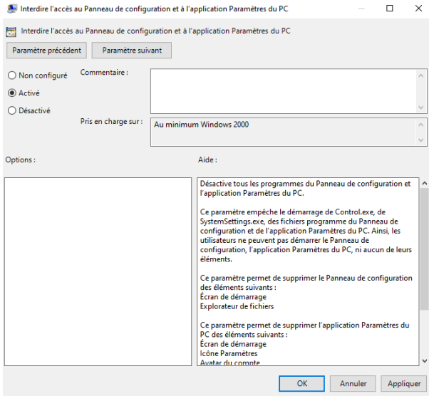

---

## Security Benefits

Restricting access to the Control Panel can:

- reduce unauthorized changes;
- prevent accidental misconfiguration;
- improve workstation consistency;
- lower the number of support incidents;
- protect security-sensitive settings.

This type of policy is particularly useful for:

- shared computers;
- student environments;
- public workstations;
- standard employee accounts;
- locked-down enterprise endpoints.

Administrative users should still retain access through properly separated privileged accounts.

---

# 1️⃣5️⃣ Disabling USB Storage

## Purpose

A Computer Configuration GPO was created to block access to removable storage devices.

USB storage devices can introduce several security risks, including:

- malware infection;
- unauthorized data transfer;
- data exfiltration;
- use of unapproved software;
- loss or theft of sensitive files.

The policy was therefore configured at computer level so that it would apply to the workstation regardless of the connected user.

---

## Configuration Path

The restriction was configured through:

```text
Computer Configuration
└── Policies
    └── Administrative Templates
        └── System
            └── Removable Storage Access
                └── All Removable Storage classes: Deny all access
```

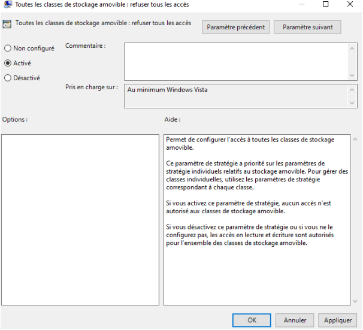

The **All Removable Storage classes: Deny all access** setting was enabled.

---

## Security Benefits

Disabling removable storage can help:

- prevent unauthorized copying of files;
- reduce the risk of removable-media malware;
- enforce data-loss prevention requirements;
- protect sensitive organizational information;
- limit the use of unmanaged devices.

In a production environment, exceptions could be created for approved users or managed devices when business needs require removable media.

---

# 🔗 Group Policy Deployment Logic

The policies created in this phase demonstrate both user-level and computer-level administration.

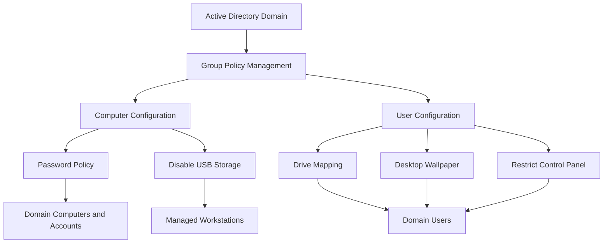

---

# 🧪 Policy Application and Testing

After creating or modifying a Group Policy, Windows clients normally refresh their policies automatically.

For testing purposes, the following command can be used on a domain-joined client:

```powershell
gpupdate /force
```

This command forces Windows to retrieve and apply the latest computer and user policies.

The following command can be used to view the policies applied to the current computer and user:

```powershell
gpresult /r
```

A more detailed HTML report can also be generated:

```powershell
gpresult /h C:\gp-report.html
```

> These validation commands will be tested once a Windows client has been joined to the domain.

---

# ✅ Group Policy Deployment Summary

During this phase of the Active Directory home lab, I:

- opened and explored the Group Policy Management Console;
- reviewed the difference between Computer Configuration and User Configuration;
- studied the difference between Policies and Preferences;
- configured password complexity requirements;
- modified the maximum password age;
- created a mapped network drive using Group Policy Preferences;
- configured a standardized desktop wallpaper;
- restricted access to the Control Panel and Windows Settings;
- disabled access to removable USB storage;
- documented the security purpose of each policy.

---

# 📚 Additional Skills Developed

- Group Policy Management Console
- Group Policy Objects
- Computer Configuration
- User Configuration
- Administrative Templates
- Group Policy Preferences
- Password Policy Management
- Drive Mapping
- Desktop Environment Management
- Endpoint Hardening
- Removable Storage Control
- Windows Security Administration
- Centralized Policy Enforcement

# ⚠️ Disclaimer

This project was completed in a personal, isolated and controlled laboratory for educational purposes.

Passwords, recovery credentials and other sensitive information are not included in this repository.
