# 🏢 Enterprise Active Directory Home Lab

> Deployment and documentation of a Microsoft Active Directory environment using Windows Server 2022 and VMware Workstation Pro.

---

## 📖 Overview

This project documents the first stage of my personal Active Directory home lab.

The objective was to build a virtualized Windows Server environment from scratch, install Active Directory Domain Services, promote the server to a Domain Controller and create an initial enterprise directory structure.

The environment was organized using Organizational Units, users and groups in order to simulate the centralized identity and resource management found in a professional Windows infrastructure.

This Active Directory environment will later become the foundation for additional Blue Team and SOC projects, including:

- Windows Event Log analysis
- Sysmon deployment
- Wazuh SIEM
- Splunk
- Detection Engineering
- SOC monitoring and incident investigation

---

## 🎯 Objectives

The objectives of this first deployment were to:

- Install VMware Workstation Pro
- Deploy a Windows Server 2022 virtual machine
- Install Windows Server from an official ISO image
- Install Active Directory Domain Services
- Install the DNS Server role
- Create a new Active Directory forest
- Promote the Windows Server as a Domain Controller
- Create an Active Directory domain
- Open and verify Active Directory Users and Computers
- Create Organizational Units
- Create users and security groups
- Organize enterprise resources by geographical region

---

## 🏗️ Lab Architecture

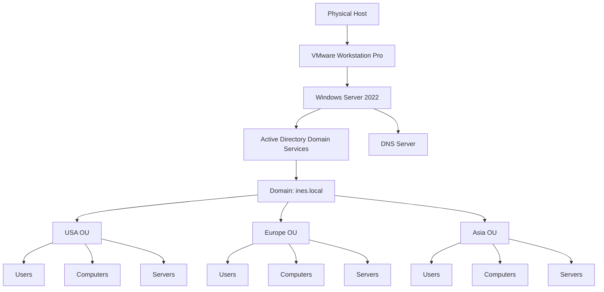

> Replace `ines.local` if the actual domain configured in the lab uses another name.

---

## 💻 Environment

| Component | Technology |
|---|---|
| Hypervisor | VMware Workstation Pro 17 |
| Server operating system | Windows Server 2022 |
| Directory service | Active Directory Domain Services |
| Name resolution | Windows DNS Server |
| Administration console | Active Directory Users and Computers |
| Environment type | Isolated personal home lab |

---

## 🛠️ Technologies Used

- VMware Workstation Pro
- Windows Server 2022
- Active Directory Domain Services
- Windows DNS Server
- Server Manager
- Active Directory Users and Computers
- Organizational Units
- Security Groups
- Identity and Access Management

---

# 1️⃣ VMware Workstation Installation

## Purpose

The laboratory was deployed using **VMware Workstation Pro**.

Virtualization makes it possible to create an isolated enterprise environment without modifying the physical host or affecting a production network.

It also allows the laboratory to be expanded later with additional systems such as:

- Windows client machines;
- Kali Linux;
- Wazuh;
- Splunk;
- Sysmon;
- other SOC monitoring tools.

## Deployment

VMware Workstation Pro was downloaded and installed on the physical Windows host.

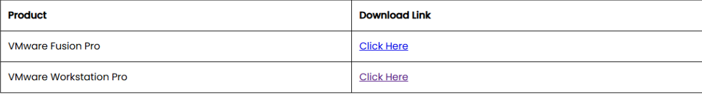

---

# 2️⃣ Windows Server 2022 Installation

## ISO acquisition

The official Windows Server 2022 evaluation ISO was downloaded from the Microsoft Evaluation Center.

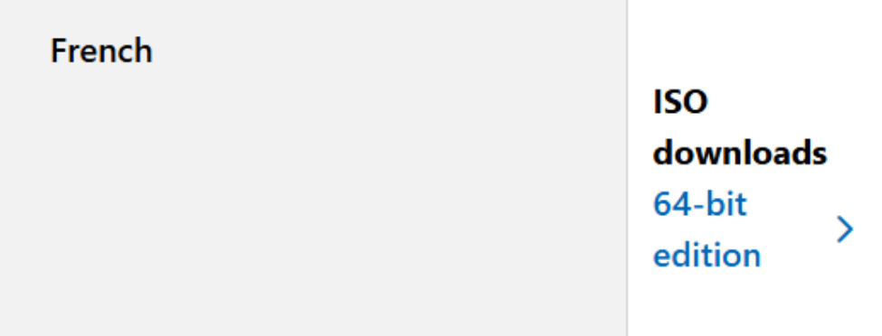

## Virtual machine creation

A new virtual machine was created in VMware Workstation Pro and configured to use the Windows Server 2022 ISO.

The virtual machine acts as the central server of the laboratory and will provide authentication, DNS and directory services.

## Server deployment

Windows Server 2022 was installed inside the virtual machine.

After the first boot, **Server Manager** opened automatically and was used to configure the server roles.

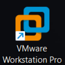

---

# 3️⃣ Active Directory Domain Services Installation

## Role installation

Active Directory Domain Services was installed from Server Manager using the following path:

```text
Manage
→ Add Roles and Features
→ Role-based or feature-based installation
→ Select destination server
→ Active Directory Domain Services
```

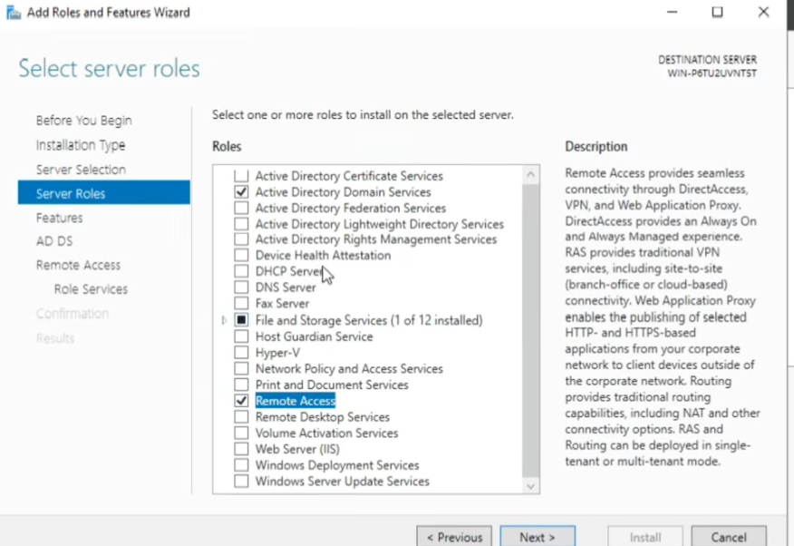

## Required features

Windows Server automatically proposed the additional management tools required for Active Directory.

These included tools such as:

- Group Policy Management;
- Active Directory Administrative Center;
- Active Directory PowerShell module;
- Active Directory Users and Computers;
- Remote Server Administration Tools.

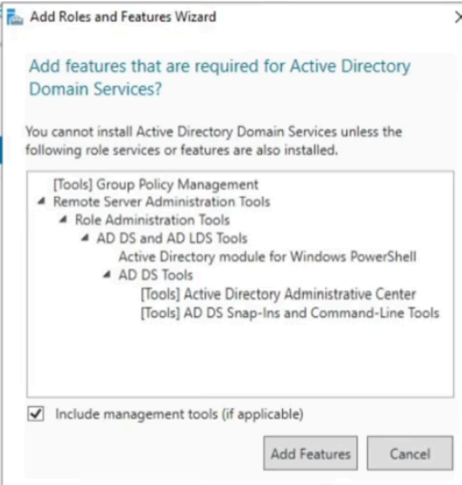

The DNS Server role was also enabled because Active Directory relies heavily on DNS to locate Domain Controllers and other domain services.

---

# 4️⃣ Creating a New Active Directory Forest

Once the AD DS role was installed, the server still needed to be promoted to a Domain Controller.

The post-deployment configuration wizard was opened and the following option was selected:

```text
Add a new forest
```

The root domain configured for the laboratory was:

```text
ines.local
```

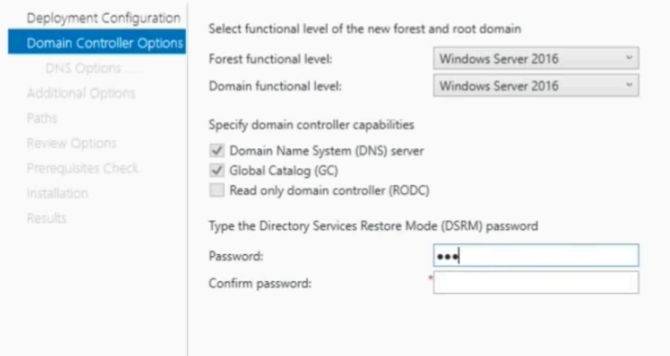

## Why create a new forest?

A forest is the highest logical structure in Active Directory.

Because this was a new and independent laboratory, there was no existing domain or forest to join. Creating a new forest established the first Active Directory domain and the first Domain Controller of the environment.

---

# 5️⃣ Domain Controller Configuration

During the Domain Controller configuration, the following components were enabled:

- Domain Name System server;
- Global Catalog;
- Directory Services Restore Mode password.

The forest and domain functional levels were configured using the most recent option available in the deployment wizard.

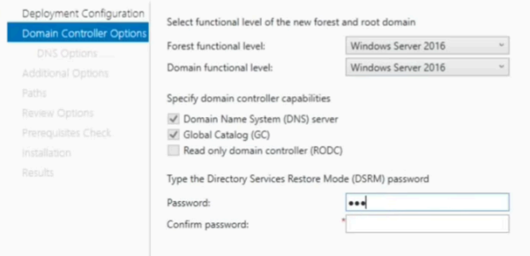

## DNS

The Domain Controller also hosts the DNS service.

DNS is essential in an Active Directory environment because clients use it to:

- find the Domain Controller;
- locate authentication services;
- resolve internal domain names;
- access domain resources.

## Directory Services Restore Mode

A Directory Services Restore Mode password was configured.

This account can be used for maintenance and recovery operations if Active Directory becomes unavailable.

The password is intentionally not included in this repository.

---

# 6️⃣ Promoting the Server to a Domain Controller

After completing the prerequisite checks, the installation was launched.

The server restarted automatically and became the first Domain Controller of the new forest.

After rebooting, the domain name appeared on the Windows authentication screen, confirming that the server was now connected to the newly created Active Directory domain.

The server now provides:

- centralized identity management;
- domain authentication;
- DNS services;
- Active Directory administration;
- policy management capabilities.

---

# 7️⃣ Verifying Active Directory

After logging back into the server, the **Active Directory Users and Computers** console was opened.

The newly created domain appeared in the console, confirming that Active Directory had been successfully deployed.

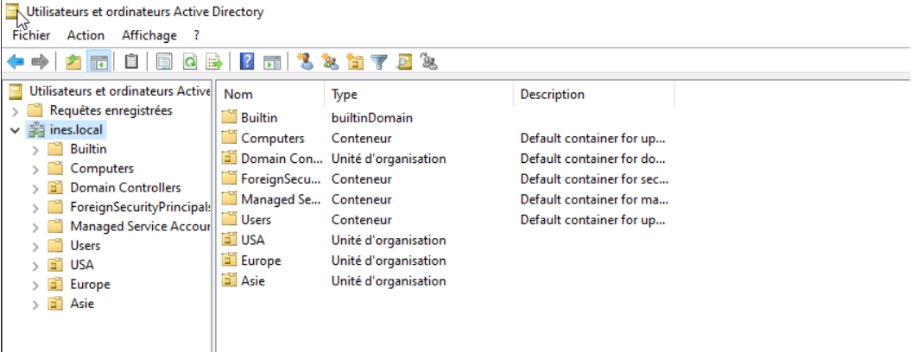

At this point, the laboratory contained:

- one Windows Server 2022 virtual machine;
- one Domain Controller;
- one Active Directory forest;
- one Active Directory domain;
- one DNS Server.

---

# 8️⃣ Creating Organizational Units

## Purpose of Organizational Units

Organizational Units allow Active Directory objects to be organized logically.

They can contain:

- users;
- groups;
- computers;
- servers;
- other Organizational Units.

They also simplify:

- Group Policy application;
- delegated administration;
- access management;
- large-scale user and computer administration.

## Structure created

The domain was organized using geographical Organizational Units:

```text
ines.local
├── USA
│   ├── Computers
│   ├── Users
│   └── Servers
├── Europe
│   ├── Computers
│   ├── Users
│   └── Servers
└── Asia
    ├── Computers
    ├── Users
    └── Servers
```

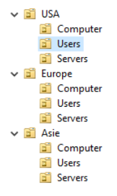

This design simulates an organization operating across several geographical regions.

Each regional OU can later receive different:

- Group Policies;
- security configurations;
- delegated permissions;
- administrative settings.

---

# 9️⃣ Creating Users and Groups

Users and groups were created inside the appropriate Organizational Units.

## Users

User accounts represent employees who will later authenticate to Windows client machines connected to the domain.

Each account can receive:

- a unique username;
- a password;
- group memberships;
- access permissions;
- domain policies.

## Security groups

Security groups make access management easier by assigning permissions to a group instead of configuring every user individually.

For example, a group could later be granted access to:

- a network share;
- a department folder;
- a server;
- an administrative tool;
- a specific application.

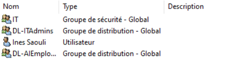

---

# 🔐 Security Considerations

Several security principles are relevant to this environment:

## Least privilege

Users should only receive the permissions required for their role.

## Group-based permissions

Permissions should preferably be assigned to security groups rather than directly to individual users.

## Separation of administration

Administrative accounts should be separated from standard daily user accounts.

## Structured Organizational Units

A clear OU design makes it easier to apply security policies consistently.

## DNS protection

Because Active Directory depends on DNS, unauthorized DNS modifications can affect authentication and domain availability.

---

# ✅ Deployment Summary

During this first stage of the Active Directory home lab, I:

- installed VMware Workstation Pro;
- downloaded and installed Windows Server 2022;
- deployed a Windows Server virtual machine;
- installed Active Directory Domain Services;
- installed the DNS Server role;
- created a new Active Directory forest;
- created the `ines.local` domain;
- promoted the server to a Domain Controller;
- verified the installation through Active Directory Users and Computers;
- created a geographical OU structure;
- created users and security groups.

---

# 📚 Skills Developed

- VMware administration
- Windows Server installation
- Windows Server administration
- Active Directory Domain Services
- Domain Controller deployment
- DNS fundamentals
- Identity and Access Management
- Organizational Unit design
- User account management
- Security group management
- Enterprise infrastructure documentation

---

# 🚀 Next Steps

The Active Directory environment will be expanded with:

- a Windows client machine;
- domain join configuration;
- additional users and groups;
- Group Policy Objects;
- shared folders and permissions;
- password and account lockout policies;
- Windows Event Log analysis;
- Sysmon;
- Wazuh SIEM;
- Splunk;
- Detection Engineering;
- simulated attack and investigation scenarios.

---

# ⚠️ Disclaimer

This project was completed in a personal, isolated and controlled laboratory for educational purposes.

Passwords, recovery credentials and other sensitive information are not included in this repository.
